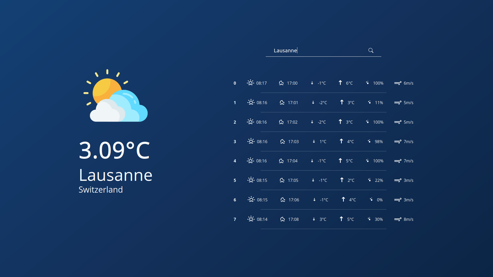

# WeatherApp

## Showcase


## Installation & Run

```
git clone git@github.com:PeacefulOtter/WeatherApp.git
```
You will need to create a `.env` file located in `/server/src` and add the following keys:
- WEATHER_API_KEY=XXX
- GEOCODE_API_KEY=XXX

These API keys can be created here, both are free:
- https://home.openweathermap.org/api_keys
- https://positionstack.com/product

Finally: 
```
cd client
npm install
npm start
```

```
cd server
npm install
npm start
```
